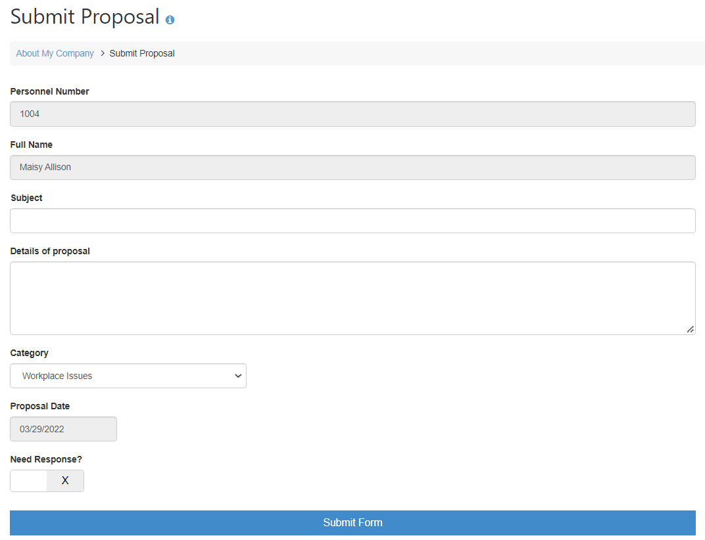
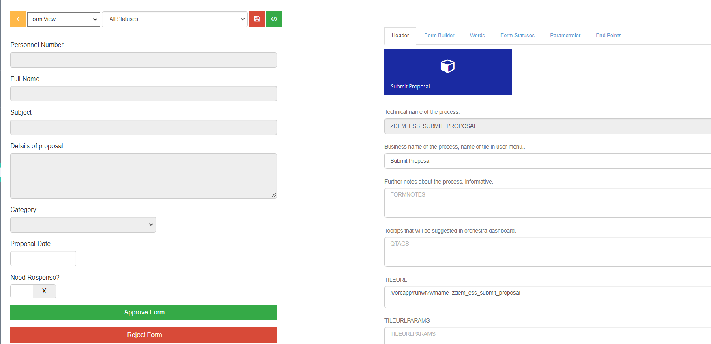

## Employee Submit Proposal Workflow Sample

# Purpose

This workflow can be used to let employees submit their improvement ideas to company responsibles under different categories.

# Workflow View

# Workflow Design

Please design your form in Orchestra Form Designer with all required fields in workflow. 

You can add or remove fields according to your requirements.

# Workflow Statuses

- NEW --- New
- SUBMITTED -- Submitted form, waiting for approval
- APPROVED -- Approved form, completed workflow
- REJECTED  --  Rejected form, completed workflow

# Workflow Fields

- PERNR --- Personnel number, who starts workflow
- ENAME -- Employee s name, workflow starter
- SUBJECT -- Proposal Subject Line
- PROPOSAL  --  Proposal details
- CATEGORY  --  Proposal category
- DATUM -- Proposal date
- NEEDRESPONSE -- User need response for proposal from approver
- DOSUBMIT -- button to submit
- DOAPPROVE -- button to approve
- DOREJECT -- button to reject

# Workflow Endpoints

- Add API s for GET and POST form event

# Workflow Roles

EMPLOYEE role used to let any employee can submit proposal.

# Activate Workflow

Add this workflow in your client from,

Settings > System Management > Workflow Selections

# Workflow Test Users

Once you create your workflow and assign apis. Please go and define your test personnel numbers.

Settings > System Management > App Test Users
